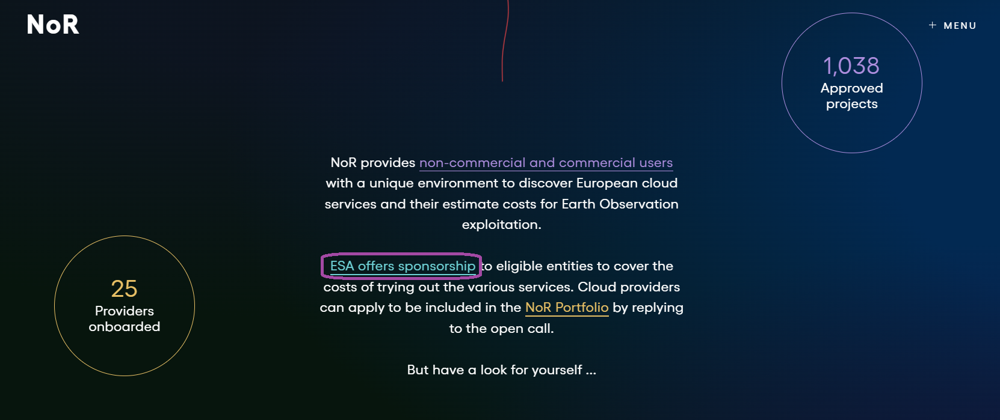
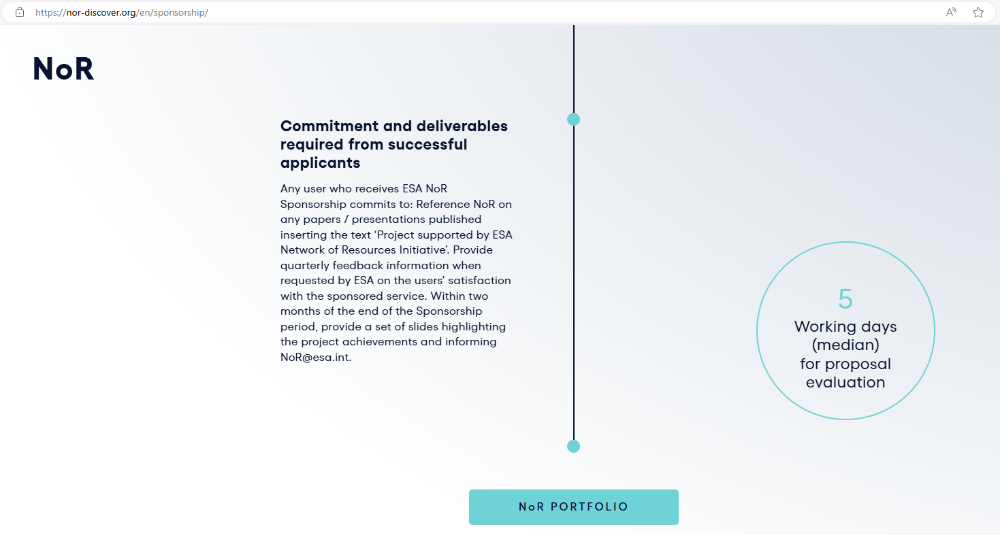
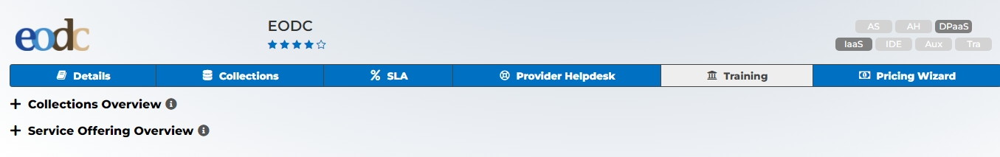

# Funding

## EODC Network of Resources Funding

Next to the openEO platform offering, EODC also offers IaaS and the Sentinel-1 sigma naught datacube on the Network of Resources (NoR).
Users are able to book services for pre-commercial, research and educational purposes. For non-ESA projects the sponsoring is limited to the Sentinel-1 datacube and 5,000 EUR as well one year duration request.

To apply for a NoR sponsorship please follow the guidelines below:

### 1. Navigate to the website
> - Go to the discover website: <https://nor-discover.org/>
> - Scroll down to ‘ESA offers sponsorship to eligible entities to cover the costs of trying out the various services.’
> - Click ESA offers sponsorship

> 

> - On the Sponsoring Page scroll all the way down to the `NoR PORTFOLIO` Button

> 

### 2. EODC Sponsoring
> - On the nor-discover page find the EODC entry and select Pricing Wizard

> 

### 3. Prizing Wizard
> - In the Prizing Wizard you select your project type
> - Select the packages you would like to book as well as the number of units and the subscription duration

### 4. ESA Sponsorship
> - At the bottom you can ask ESA for a sponsorship
> - If your project is an ESA project, please select `yes` in the dropdown menu ‘ESA Project’
> - If your project is not an ESA project, you cannot book IaaS
> - Decide if you want to co-fund the costs and move on by clicking on the button `Ask ESA for Sponsorship`

### 5. Finalize your application
> - On a new pageDetails of the organization/company and the project must then be entered.
> - When all required fields have been filled in export your sponsoring request and send it to <NoR@esa.int>.

