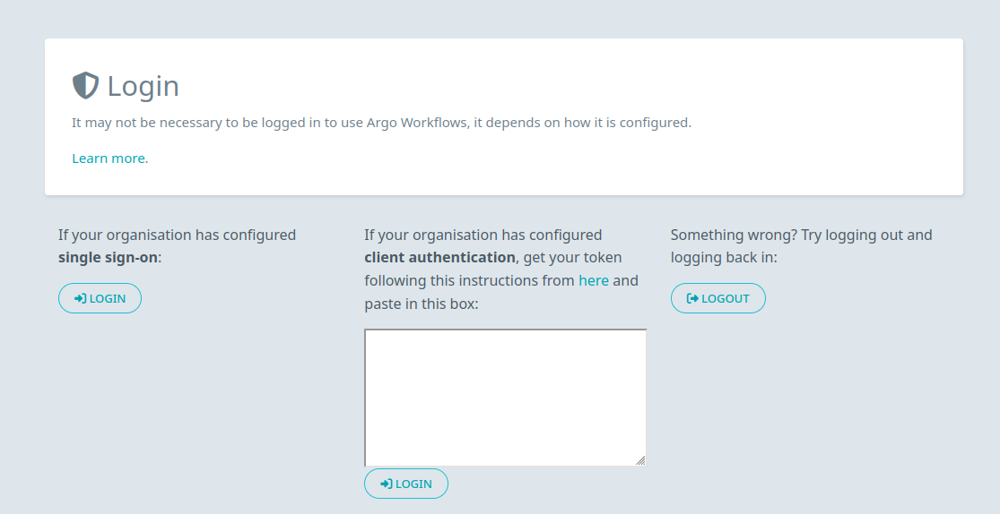
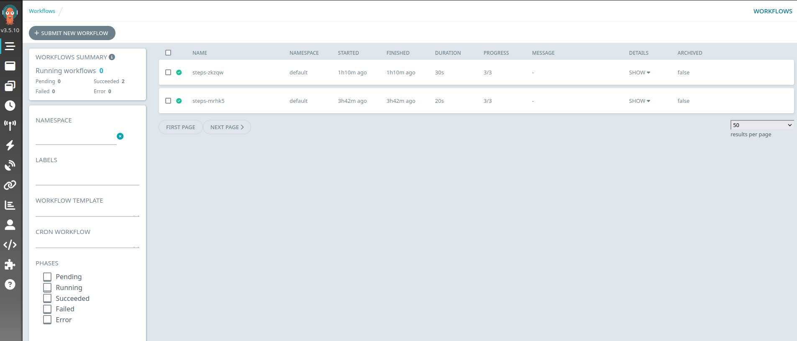
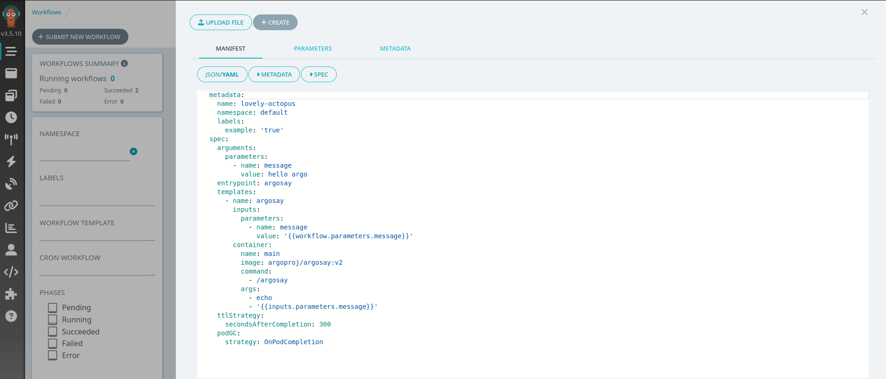
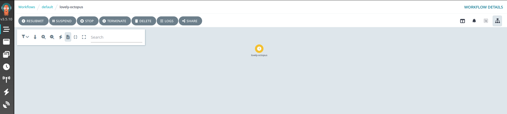

# Argo Workflows

This user documentation provides an overview of using the Argo Workflows deployment at EODC in order to run your earth observation processing at scale.

  

    
  

  

    <strong>Eodc SDK for Argo Workflow</strong> 
    
Introduction on how to use the EODC SDK for Argo Workflow.

    

    <a href="eodc_sdk_argo.md" style="text-decoration:none;color:#1d70b8;font-weight:bold;">View Notebook</a>
  

## What is Argo Workflows?

### Overview

[Argo Workflows](https://argo-workflows.readthedocs.io/en/latest/) is an open-source container-native workflow engine designed to orchestrate jobs on Kubernetes. It allows users to define complex workflows as directed acyclic graphs (DAGs), facilitating the automation of multi-step tasks such as data processing and machine learning pipelines. Built to handle large-scale workloads, Argo Workflows is highly efficient for cloud-native applications and integrates seamlessly with Kubernetes environments.

### Who Should Use Argo Workflows at EODC?

If any of the following sounds familiar, an Argo Workflow may be right for you.

- **Containerization**: Anyone who already has a container, or would like to use an existing container to be run at scale across hundres or thousands of satellite images.

- **No python**: Anyone who already has a code base in a language other than python, and can't leverage the power of Dask. It may be easier to build a run time and tailor a workflow solution instead porting the code to python.

- **Regularity**: Anyone who would like to run specific processing on a daily, or timely basis, the CronWorkflow would enable you to do that. The results can be uploaded to a S3 bucket and added to a STAC collection automatically.

## Submitting an Argo Workflow

### Pre-requisite

You will need to submit a request to the [EODC Support Team](mailto:support@eodc.eu) and request access to Argo Workflows. If you want to use argo-workflows via the eodc-sdk, you currently will need a token, make sure to request this in the support request.

### Via the dashboard

1. Login to the Argo Workflows [Dashboard](https://services.eodc.eu/workflows/login) using the single sign-on option.

2. Navigate to the workflows section of the dashboard. This is the top icon on the sidebar.

3. Click *Submit New Workflow* a pop up will open. A workflow can either be loaded from a file, or submitted directly as a yaml.

4. Once you click create workflow, a new workflow will have appeared. Monitor for its success or failure!

### Via the eodc-sdk

It's possible to use the argo workflows deployments at EODC with eodc-sdk version later than 2024.9.1. 

Refer to the tutorial [here](eodc_sdk_argo.md).