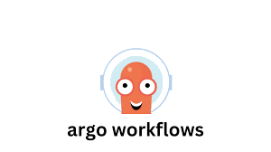

# Demo Argo Workflow

Back to main gallery:

<div class="notebook-card" data-tags="" style="display:flex;align-items:flex-start;border:1px solid #cddff1;border-radius:6px;padding:14px 20px;background:#f9fbfe;box-shadow:1px 1px 4px #dfeaf5;margin-bottom:20px">
  <div style="width:120px;height:90px;flex-shrink:0;display:flex;align-items:center;justify-content:center;background:#fff;border:1px solid #e0eaf5;border-radius:6px;overflow:hidden;margin-right:24px;">
    
  </div>
  <div style="flex:1;">
    <strong>Argo Workflow</strong><br>
    <div style="margin:4px 0 8px 0;">Back to main gallery.</div>
    <div style="margin:6px 0 10px 0;"></div>
    <a href="argo_workflows.md" style="text-decoration:none;color:#1d70b8;font-weight:bold;">View Notebook</a>
  </div>
</div>

##  Submit Custom

```python
import eodc
```

First we need to provide some settings configuration in order to be able to interact with the service.

1. FAAS_URL. This is the URL of the Argo Workflow service.
2. NAMESPACE. This is the intended namespace in the kubernetes cluster for creating the Argo Workflows.
3. ARGO_WORKFLOWS_TOKEN. This is the token that will be used to authenticate with the Argo Workflows server.


```python
from eodc.settings import settings

settings.FAAS_URL ="https://services.eodc.eu/workflows/"
settings.NAMESPACE = "default"
settings.ARGO_WORKFLOWS_TOKEN = ""
```

Within eodc.faas ther CustomWorkflow class makes use of the FaasProcessorBase that has a number of functions defined for interacting with Argo Workflow resources. We will use the eodc.faas.FaasProcessor.custom in order to instantiate a service connection that will allow us to submit an arbitrary Argo Workflow.


```python
service = eodc.faas.CustomWorkflow(
    processor_details=eodc.faas.FaasProcessor.custom
)
```

Using [Hera](https://hera.readthedocs.io/en/stable/), it is possible to define Argo Workflow resources in code. The following is an example resource taken from their documentation.


```python
from hera.workflows import Container, Parameter, Step, Steps, Workflow, WorkflowsService

def hello(service: WorkflowsService):
    with Workflow(
        workflows_service=service,
        namespace=service.namespace,
        generate_name="steps-",
        entrypoint="hello-hello-hello",
    ) as w:
        print_message = Container(
            name="print-message",
            image="busybox",
            command=["echo"],
        )

        with Steps(name="hello-hello-hello") as s:
            Step(
                name="hello1",
                template=print_message,
                arguments=[Parameter(name="message", value="hello1")],
            )

            with s.parallel():
                Step(
                    name="hello2a",
                    template=print_message,
                    arguments=[Parameter(name="message", value="hello2a")],
                )
                Step(
                    name="hello2b",
                    template=print_message,
                    arguments=[Parameter(name="message", value="hello2b")],
                )
    return w
```

Once you have an Argo Workflow resource that is has been wrapped in a function that will passes the workflow service on instantiation. You will be able to submit it to the Argo Workflow server in the following way.


```python
name = service.submit_workflow(
    workflow=hello(service.workflows_service)
)
```

A number of functions are available via the eodc-sdk to monitor and interact with Argo Workflows. To get the workflow logs, we can use the .get_logs() function.


```python
service.get_logs(name)
```
