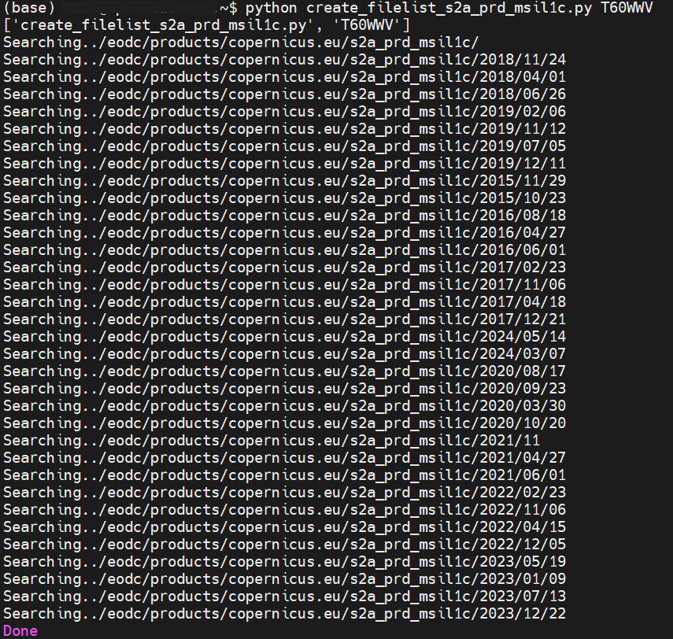
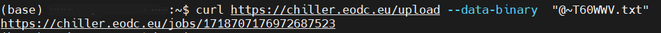

# Chiller API 

Chiller API - preparing data for large processing jobs

## Why do I need Chiller?

EODC stores data, that is not recently used, on tape infrastructure (cold storage) which has several advantages for long term storage. This data is visible on the file system, however for large processing jobs a recall to disk storage (hot storage) can be very helpful to avoid long loading times. In order to process the desired data, a file list must be created, which is then given as input to the EODC's own program Chiller, which moves the data from the tape storage to the disk storage, this process is also called "data staging".


## Filelist preparation

### 1. Requirements

EODC customers who have access to the EODC network may stage data before processing. For this you need the following: 
- A VM on EODC infrastructure to access the "/eodc/products/" folder to curate a file list that can be uploaded to chiller 
- A script that creates the file list (example python script for Sentinel 2 data provided below)


### 2. Use case

In this example use case we will stage a time series of Sentinel 2 L1C data from the Sentinel 2-A Satellite. We pick a specific UTM tile which shall be staged to disk. To create the file list, we execute the python script below through a ssh terminal connected to a VM within the EODC network.


### 3. Python example

The following Python script searches for all files with the given UTM tile of the Sentinel 2-A satellite and saves the found file names in a list. Afterwards the file list is saved in the home folder of the VM.

```
import os
import fnmatch

import numpy as np
import sys
import datetime
import shutil
print(sys.argv)


# Define the root directory to start the search
root_directory = "/eodc/products/copernicus.eu/s2a_prd_msil1c/"

# Define the search pattern (string to search for)
search_pattern = "*"+sys.argv[1]+"*"

# Create an empty list to store matching file paths
matching_files = []
file_names = []

# Walk through the directory tree and find matching files
counter = 0
for dirpath, dirnames, filenames in os.walk(root_directory):
    if counter % 100 == 0:
        print("Searching.." + dirpath)
    counter += 1
    for filename in fnmatch.filter(filenames, search_pattern):
        matching_files.append(os.path.join(dirpath, filename))
        file_names.append(filename)

#print (file_names)
with open(r'~'+sys.argv[1]+'.txt', 'w') as fp:
    for item in matching_files:
        fp.write("%s\n" % item)
    print("Done")

```


### 4. Running the code and writing the filelist

We have selected the UTM tile T60WWV for our use case.
To start the script, the following expression must be called. First 'python', then the name of the script and then the selected tile.

```
python create_filelist_s2a_prd_msil1c.py T60WWV
```

Now the algorithm searches for every file with the selected UTM tile. When the search is finished, `Done` appears (see image below). Then the target folder specified in the script can be refreshed and a .txt file with the file list should have been created. The file list is now prepared for posting it with curl to the chiller api.




## Staging the data with Chiller

To move the data from the tape storage to the disk storage, a job containing the generated file list is started.
```
curl https://chiller.eodc.eu/upload --data-binary  "@~T60WWV.txt"
```
After the command has been executed, the ID of the job is the output. The ID can be used to call up the status of the job.



The status of the job can be shown with another curl command.
```
curl https://chiller.eodc.eu/jobs/1718707176972687523
```

When `"Finished":"true"`, then the job is done and the staging is completed. Now, for example, the NDVI can be calculated faster with all files of the time series, as all data is available on disk. To do this, a Python script must be loaded again which contains the file list.

