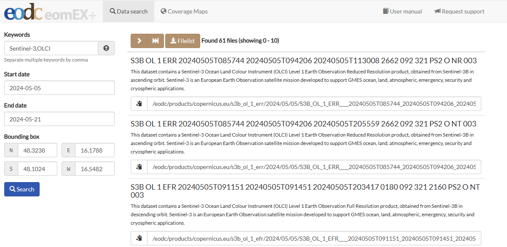

# CSW

## How to use eomEX+ data Catalogue
Another possibility to access EODC data of the ESA missions Sentinel-1, Sentinel-2 and Sentinel-3 is the Catalogue Service (CSW) from Open Geospatial Consortium. This can be accessed via the following link: 
<https://eomex.eodc.eu/>

The data can be filtered and selected according to temporal and spatial extent. If you are searching for specific data set, you can enter one or more keywords (e.g. Sentinel-3, OLCI). The keywords are predefined and can be displayed using the question mark on the right-hand side of the input line.
To define the spatial extent, four coordinates must be entered in decimal degrees. The latitude is entered in decimal degrees for North and South and the longitude is entered in decimal degrees for East and West. The desired time period can also be selected.

