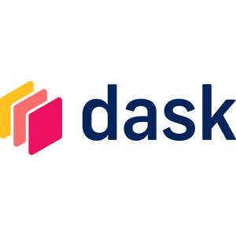
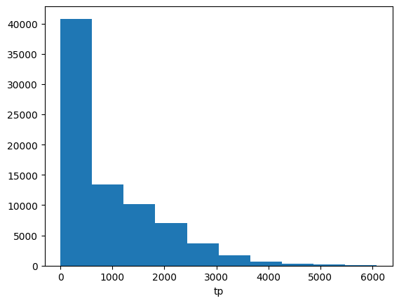

# Dask Gateway 

This user documentation provides an overview of Dask Gateway, its setup at EODC, and how to use it for managing and scaling Dask clusters for large-scale data analysis.

<div class="notebook-card" data-tags="" style="display:flex;align-items:flex-start;border:1px solid #cddff1;border-radius:6px;padding:14px 20px;background:#f9fbfe;box-shadow:1px 1px 4px #dfeaf5;margin-bottom:20px">
  <div style="width:120px;height:90px;flex-shrink:0;display:flex;align-items:center;justify-content:center;background:#fff;border:1px solid #e0eaf5;border-radius:6px;overflow:hidden;margin-right:24px;">
    
  </div>
  <div style="flex:1;">
    <strong>Distributed computing with Dask</strong><br>
    <div style="margin:4px 0 8px 0;">This notebook demonstrates how to use the EODC Dask service via Dask Gateway for scalable, distributed data analysis</div>
    <div style="margin:6px 0 10px 0;"></div>
    <a href="dask.ipynb" style="text-decoration:none;color:#1d70b8;font-weight:bold;">View Notebook</a>
  </div>
</div>


## What is Dask Gateway?


### Overview

EODC offers Dask as a service by utilising [Dask Gateway](https://gateway.dask.org/). User can launch a Dask cluster in a shared and managed cluster environment without requring to have direct access to any cloud infrastructure resources such as VMs or Kubernetes clusters. The objetive is to lower the entrance barrier for users to run large scale data analysis on demand and in a scaleable environment.

An generic introduction of the usage of Dask Gateway can be found on the official [Dask Gateway documentation](https://gateway.dask.org/usage.html). In the following we will demonstrate the use of the Dask service at EODC to further support users.

### Why Choose Dask Gateway at EODC?

Dask Gateway at EODC is specifically tailored for users who need to perform large-scale data analysis, particularly in the fields of geospatial analysis, time-series data processing, and data science. Here’s why Dask Gateway is a compelling choice:

1. **Efficient Resource Management**: Dask enables the parallel processing of large datasets across multiple nodes, making it ideal for computationally intensive tasks. This is especially beneficial for users dealing with massive datasets, such as satellite imagery or climate data.

2. **Flexibility and Scalability**: Unlike traditional systems where users are constrained by the limitations of a single machine, Dask allows users to scale their computations across a cluster of machines. This is particularly useful for projects that require varying levels of computational power over time.

3. **Seamless Integration with Python Ecosystem**: Dask is built natively for Python, making it easy to integrate with existing Python-based workflows. This is particularly relevant for data scientists and analysts who already use Python for their projects.


### Who Should Use Dask Gateway at EODC?

Dask Gateway at EODC is suitable for:

- **Researchers and Scientists**: Who need to process large-scale environmental or geospatial data.
- **Data Scientists**: Looking to perform advanced data analysis and machine learning on large datasets.
- **Engineers and Developers**: Who require scalable computing resources for data processing tasks that exceed the capacity of their local machines.

In summary, if your work involves handling and processing large datasets and you need a scalable, efficient computing environment that minimizes the burden of infrastructure management, Dask Gateway at EODC is an optimal choice.

### Steps for Authorization:

1. **Authentication via Keycloak**:
    - **What It Is**: Keycloak is an identity and access management system that EODC uses to authenticate users. Think of it as a secure gatekeeper that ensures only authorized users can access EODC's computing resources.
    - **How to Get Access**: If you do not already have a Keycloak account, you need to request one by emailing the [EODC Support Team](mailto:support@eodc.eu). In your request, include your full name, organization, and the reason you need access. Once your account is set up, you will receive your login credentials.
    - **How It Works**: After you log in with your EODC credentials, Keycloak issues a JSON Web Token (JWT). This token acts like a digital pass that you will use in your interactions with the EODC Dask Gateway server.
    
2. **Using a JWT (JSON Web Token)**:
    - **What It Is**: A JWT is a secure token that contains information about your identity and permissions. It is automatically generated by Keycloak after you authenticate.
    - **Why It's Important**: The Dask Gateway server checks this token to ensure you have the necessary permissions to access and manage Dask clusters. The token is handled automatically by the system, so you don't need to manage it manually.

## EODC-Specific Setup

At EODC, we provide a robust setup that ensures your data analysis workflows are smooth, scalable, and easy to manage. Here's what you need to know:

### Docker at EODC

- **What It Is**: Docker at EODC is used to create portable, consistent, and isolated environments that include not just your Python setup but the entire operating system and any other tools your application might need. This is especially useful for ensuring that your data analysis pipelines run identically on different machines, whether on your local system, EODC’s servers, or in the cloud.

- **When to Use It**: Use Docker when your project requires more than just Python libraries—such as specific system tools, dependencies that are difficult to manage with Conda, or when your application needs to run consistently across different environments. Docker is also preferred when deploying applications in production, where reproducibility and isolation are critical.

- **What You Need to Do**: EODC provides a standard Docker image that includes a baseline environment suitable for most data analysis tasks. You can either use this image directly or customize it to include additional dependencies specific to your project.

  1. **Download the Docker Image:**

    - Pull the pre-built Docker image from EODC's Docker registry using the following command:

    ```sh
    docker pull registry.eodc.eu/eodc/kathi_test/my-updated-image
    ```

  2. **Run the Docker Container:**

    - Start the container with the following command, which will launch a Jupyter Notebook server:

    ```sh
    docker run -p 8888:8888 registry.eodc.eu/eodc/kathi_test/my-updated-image
    ```
    - You’ll be provided with a URL containing a token. Open this URL in your browser to access the Jupyter Notebook interface. Please note that the URL is making use of http and not https.

  3. **Accessing Dask Gateway:**

    - Inside the Jupyter Notebook, you'll find pre-configured example-notebook that demonstrate how to connect to and use the Dask Gateway Service at EODC.

    - All necessary libraries and configurations are already included in the Docker image, so you can focus on your data analysis without worrying about setup issues.

  4. **Using the EODC Dask Gateway in Your Notebook:** 
    
    - **Authentication:** After launching the Jupyter Notebook, authenticate and connect to the EODC Dask Gateway using the code provided in the notebook. The authentication process involves using your Keycloak credentials—your email as the username and your Keycloak password.

    ```python
    from eodc_connect.dask import EODCDaskGateway
    from rich.console import Console
    from rich.prompt import Prompt

    console = Console()
    your_username = Prompt.ask(prompt="Enter your Username")
    gateway = EODCDaskGateway(username=your_username)
    ```
    This integration allows seamless access to the Dask Gateway, ensuring you can efficiently scale your computations.
  
  5. **Connecting and Managing Clusters**:

    - **What You Need to Do**: Once authenticated, you can create and manage a Dask cluster using the following commands:

    ```python
    cluster = gateway.new_cluster()
    client = cluster.get_client()
    cluster
    ```
    
    **Important: Please use the widget to add/scale the Dask workers. Per default no worker is spawned, therefore no computations can be performed by the cluster.** If you want to spawn workers directly via Python adaptively, please use the method described in the [adaptive scaling section](#adaptive-scaling).

    - **Result**: This will start a new Dask cluster that you can now use for your data processing tasks.


### What to Do if You Encounter Issues

- **Compatibility Issues**: If your code runs into problems because the environment on your local machine is different from the environment on the Dask clusters, try using the EODC-provided Conda environment or Docker image. This ensures everything is set up correctly.

Run the following in order to make sure all dependencies are met:

```python
!pip install bokeh==2.4.2 dask-gateway==2023.1.1 cloudpickle==2.2.1 s3fs==2023.6.0 fsspec==2023.6.0 xarray==2023.7.0 dask==2023.8.0
```

- **Need Help?**: If you're not sure what to do, or if you run into any issues, have a look at the official website of [Dask Gateway documentation](https://gateway.dask.org/usage.html) or contact the [EODC Support Team](mailto:support@eodc.eu) for assistance.


## Cluster Profiles and Configuration at EODC

At EODC, Dask Gateway is configured with default resource allocations that suit the needs of most users. These settings can be customized according to specific project requirements.

### Default Cluster Configuration

- **Standard Resources**:
  - **Scheduler Cores**: 2 CPU cores
  - **Scheduler Memory**: 4 GB RAM
  - **Worker Cores**: 4 CPU cores
  - **Worker Memory**: 8 GB RAM

These settings are the default configuration for most users, providing a balanced environment for typical data processing tasks.

- **Idle Timeout**: Clusters will automatically shut down after 6 hours of inactivity. This helps to optimize resource usage and minimize costs.

### Exposing and Understanding Cluster Options

Before customizing your Dask cluster, it’s important to understand the available options and the limits that are in place to ensure efficient resource usage across EODC's infrastructure.

- **Available Options**: EODC provides predefined cluster options that users can adjust. These include:
  - **Worker Cores** (`worker_cores`): The number of CPU cores allocated per worker.
  - **Worker Memory** (`worker_memory`): The amount of memory allocated per worker.
  - **Docker Image** (`image`): The Docker image used for the cluster, which can be customized based on specific needs.

- **Limits and Constraints**:
  - **Worker Cores**: Users can allocate between 2 and 8 CPU cores per worker.
  - **Worker Memory**: Users can allocate between 2 GB and 16 GB of RAM per worker.
  - These limits are set to ensure fair usage of resources and to prevent any single user or task from monopolizing the cluster’s capacity.

### Customizing Cluster Options

Once you understand the available options and the constraints in place, you can customize your Dask cluster configuration to better align with your project’s requirements.

- **Adjusting Resources**: Based on your needs, you can modify the cluster options within the allowed limits. Here’s an example:

    ```python
    cluster_options = gateway.cluster_options()
    cluster_options.worker_cores = 4  # Set the number of CPU cores per worker (within the range 2-8)
    cluster_options.worker_memory = "8GB"  # Set the memory allocation per worker (within the range 2-16 GB)
    cluster = gateway.new_cluster(cluster_options)
    ```


## Managing Your Dask Cluster

After setting up your Dask cluster, there are several important operations you can perform to manage your computational resources efficiently.

### Adaptive Scaling

Adaptive scaling allows your Dask cluster to automatically adjust the number of workers based on the current workload. This ensures that you have enough computational resources when needed, while minimizing costs when the cluster is idle.

- **Enabling Adaptive Scaling**:
  
  To enable adaptive scaling, use the following command:

  ```python
  cluster.adapt(minimum=2, maximum=8)
  ```
  In this example, the cluster will start with 2 workers and can scale up to a maximum of 8 workers depending on the workload. Dask will add or remove workers automatically based on the tasks being processed.

- **Why Use Adaptive Scaling**:

    Adaptive scaling is useful when your workload varies significantly over time, as it ensures that your cluster is always optimally sized for the tasks at hand, avoiding over-provisioning and unnecessary costs.

### Connecting to an Existing Cluster

Sometimes you might need to reconnect to a Dask cluster that is already running, either to continue working or to monitor its status.

- **How to Connect**:

    If you have a list of existing clusters, you can connect to one using its name or ID:

    ```python
    clusters = gateway.list_clusters()
    cluster = gateway.connect(cluster_name=clusters[0].name)
    client = cluster.get_client()
    ```
    This will allow you to interact with the cluster as if it were newly created, enabling you to submit new tasks or monitor ongoing computations.


### Stopping a Cluster

When you're done with your computations, it's important to stop the cluster to free up resources and avoid unnecessary costs.

- **Stopping a Single Cluster**:
To stop a cluster and release its resources, use the following command:

    ```python
    cluster.shutdown()
    ```

- **Or for multiple clusters**:

    ```python
    for cluster in clusters: 
    cluster.shutdown()
    ```

This ensures that all resources are properly freed, and no unnecessary charges are incurred.

## Display Dask Dashboard to monitor execution of computations

Dask Gateway provides a dashboard to monitor your cluster's performance. Copy the following link into a browser of your choice. Please consider the dashboard URL provided is making use of http and not https.

```python
cluster.dashboard_link
print(f"Dashboard link: {dashboard_link}")
```
Open the provided URL in your web browser to view the dashboard. The dashboard provides visualizations of task progress, memory usage, CPU usage, and more, which are crucial for optimizing and troubleshooting your computations.


### Example

```python
import s3fs
import xarray as xr

s3fs_central = s3fs.S3FileSystem(
    anon=True,
    use_ssl=True,
    client_kwargs={"endpoint_url": "https://s3.central.data.destination-earth.eu"})

s3fs_lumi = s3fs.S3FileSystem(
    anon=True,
    use_ssl=True,
    client_kwargs={"endpoint_url": "https://s3.lumi.data.destination-earth.eu"})
```

```python
s3fs_central.ls("increment1-testdata")
```

Read data stored in S3 bucket at central site (Poland). The data we want to read is a single Zarr data store representing GFM flood data over Pakistan for 2022-08-30

```python
flood_map = xr.open_zarr(store=s3fs.S3Map(root=f"increment1-testdata/2022-08-30.zarr", s3=s3fs_central, check=False),
                         decode_coords="all",)["flood"].assign_attrs(location="central", resolution=20)
flood_map
```

Run simple computation and compute the flooded area:

```python
flooded_area_ = flood_map.sum()*20*20/1000.
flooded_area_
```

So far we haven't computed anything, so lets do the computation now on the Dask cluster.


```python
flooded_area = client.compute(flooded_area_, sync=True)
console.print(f"Flooded area: {flooded_area.data}km2")
```

Read data stored in S3 bucket at LUMI bridge (Finland). Data we want to read is a datacube generated from ERA-5 representing predicted rainfall data.

```python
rainfall = xr.open_zarr(store=s3fs.S3Map(root=f"increment1-testdata/predicted_rainfall.zarr",
                                         s3=s3fs_lumi,
                                         check=False),
                        decode_coords="all",)["tp"].assign_attrs(location="lumi", resolution=20)
rainfall
```


````python
from datetime import datetime
from attr import dataclass

def accum_rain_predictions(rain_data, startdate, enddate, extent):
    rain_ = rain_data.sel(time=slice(startdate, enddate),
                          latitude=slice(extent.max_y, extent.min_y),
                          longitude=slice(extent.min_x, extent.max_x))
    return rain_.cumsum(dim="time", keep_attrs=True)*1000

@dataclass
class Extent:
    min_x: float
    min_y: float
    max_x: float
    max_y: float
    crs: str

# compute accumulated rainfall over Pakistan
roi_extent = Extent(65, 21, 71, 31, crs='EPSG:4326')
acc_rain_ = accum_rain_predictions(rainfall, startdate=datetime(2022, 8, 18),
                                             enddate=datetime(2022, 8, 30),
                                             extent=roi_extent)

# compute average rainfall for August 2022
rain_ = rainfall.sel(time=slice(datetime(2022, 8, 1), datetime(2022, 8, 30))).mean(dim="time", keep_attrs=True)*1000
rain_
````

And again run the computation on our EODC Dask cluster. First we compute the accumulated rainfall over Pakistan. Secondly we compute the average rainfall for August 2022 (monthly mean) at global scale.

```python
acc_rain = client.compute(acc_rain_, sync=True)
acc_rain
mean_rain = client.compute(rain_, sync=True)
mean_rain
```

Plot a histogram of the accumlated rainfall computed for Pakistan.

```python
acc_rain.plot()
```


```python
cluster.close(shutdown=True)
```
## Additional Considerations

When working with Dask Gateway at EODC, it is essential to ensure that your computing environment is properly configured to handle the scale and complexity of the tasks you intend to perform. Always monitor the performance of your clusters and adjust resources accordingly to optimize both efficiency and cost. For advanced use cases, refer to the official [Dask Gateway documentation](https://gateway.dask.org/usage.html) and consider reaching out to the [EODC Support Team](mailto:support@eodc.eu) for further assistance.
