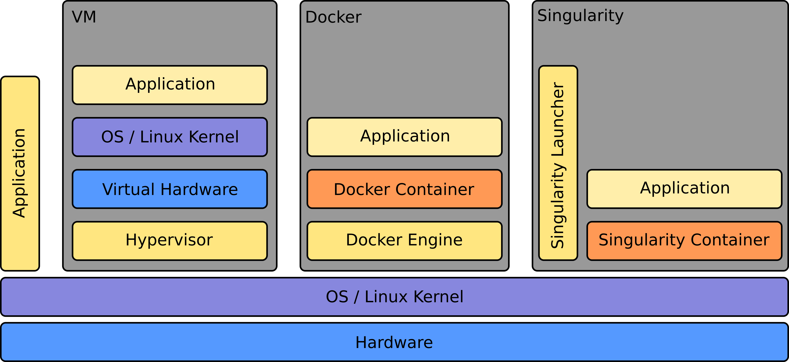

# HPC


## Why using HPC over the cloud?
HPC clusters are purpose-built for high-performance tasks. They consist of specialized hardware, high-speed interconnects, and optimized software stacks that makes them significantly faster execution of compute-intensive applications compared to the shared infrastructure of cloud computing, which may be limited in node size and may vary in performance based on the underlying virtualization and resource allocation. Furthermore, while the cloud offers flexibility in scheduling and running workflows, the HPC has a destinct scheduling system that allows to allocate the resources that the user needs for the jobs. This means that it is also more cost-efficient for the user. 
Therefore, for very compute intense tasks which need a large amount of CPUs or GPUs to compute the HPC environment offers a cost-efficient tailored infrastructure.

### Why using EODC HPC over any other HPC?

EODC's large EO data repository is available directly from the HPC. Twelve fast 200Gbps Infiniband links secure that the data is readable with very low latency. The repository mainly holds Sentinel 1, 2 and 3 data but also offers access to a vast amount of other sensors. Additionally EODC offers its customers to download and host data for their projects which means that you may request a collection that you can use on the HPC for processing. 

To find out more about our data offering please visit our [website](https://eodc.eu/) 

 

## How to use HPC powered by EODC?

To access our HPC system, the project needs to get approved first and the users would need to have appropriate permissions and credentials. This is why we would need you to provide the following information in order for us to get started deploying your project:

- What is it for?
	- Use Case Name:
	- Description of your project (500 words):
- Who is it for?
	- Contact Points for your deployment:
	- Users:
		- Names - Phone Numbers (for 2FA) - SSH public key
- Formalities:
	- How many CPU/hours will you need:
	- What are your EO Storage requirements connected to VSC?
	- Start date of the deployment:
	- Do you need GPU/hours? How many?

 
Once we have collected this information from you we will enable access through our cloud infrastructure to the HPC infrastructure. 
In a welcome e-mail we will provide you with all the neccessary infromation to login to the HPC.


### Login Guide


For Windows users we recommend to use [MobaXterm](https://mobaxterm.mobatek.net/) to setup your connection. Linux users have usually by default an ssh client in the commandline available. 
If you are an EODC customer who already has access to the cloud infrastructure you will be able to use your VM to login to the HPC. Otherwise we will provide you with a jump host to use to login to the HPC.

All further needed login information will be provided in our welcome e-mail. Be aware that we need a phone number because a one time password (OTP) will be sent to you via sms on login.  


## HPC usage

The HPC cluster works with a job scheduler called Slurm. You can submit your jobs in the form of a batch script containing the code you want to run and a header of information needed by the job scheduler. 
Slurm has an excellent [documentation](https://slurm.schedmd.com/quickstart.html) available. If you haven't used it please familiarize yourself before running any jobs at the HPC cluster.


### Basic commands

You can use Slurm as well to display your previous scheduled jobs or to see how busy the cluster is. For this you need a couple of basic commands:

`sinfo` - will show you an overview of the cluster and the available nodes and their state. See also the [slurm documentation](https://slurm.schedmd.com/sinfo.html) for more detailed view on the potential states that Partition can be in.

`squeue -u [username]` replace [username] with your username. The command will show you your current running jobs in the HPC and their status.

`sacct`  displays accounting information for all jobs 

`sbatch [scriptname.slrm]` - schedule the script [scriptname.slrm] on the cluster. See below for a minimum example.  

`scancel [jobid]` cancels the job with the ID [jobid]. Use `squeue -u [username]` before to see which jobs you might want to cancel.


A job always creates an output file into your home directory i.e. slurm-[ID].out - which contains the output status messages of your script or your program that you run. 


### Minimum example


To run an example python script you may want to use the example (called "deftestjob.slrm") below:

```
#!/bin/bash -e
#SBATCH --job-name=test_33UXQ
#SBATCH --time=20:00:00
#SBATCH -n 128

python calc_ndvi.py 33UXQ


```

There are several [more options](https://slurm.schedmd.com/sbatch.html) that may be set. 


Here is the python script that may be run called calc_ndvi.py. Jobs at this scale in Earth Observation Science are usually split at tile base level. Hence the calc_ndvi.py takes a UTM Tile as input (in this case 33UXQ) and computes the NDVI over all the available files.

```
import os
import fnmatch

import zipfile
import numpy as np
import rasterio
from rasterio.plot import show
from rasterio.windows import Window
from rasterio.profiles import DefaultGTiffProfile
import sys
import datetime
import shutil
print(sys.argv)


# Define the root directories to start the search


root_directory = "/eodc/products/copernicus.eu/s2a_prd_msil1c/"
home_fld = "/home/fs72030/bschumacher/"
destination_directory = "~/unpack/"
output_fld = "/home/fs72030/bschumacher/ndvi_results/"


# Define the search pattern (string to search for)
search_pattern = "*"+sys.argv[1]+"*"

# Create an empty list to store matching file paths
matching_files = []
file_names = []

# Walk through the directory tree and find matching files
counter = 0
for dirpath, dirnames, filenames in os.walk(root_directory):
    if counter % 100 == 0:
        print("Searching.." + dirpath)
    counter += 1
    for filename in fnmatch.filter(filenames, search_pattern):
        matching_files.append(os.path.join(dirpath, filename))
        file_names.append(filename)

for i in range(0, len(matching_files)):
#    print(file_names[i])
#    current_file = file_names[i][:-4]

#current_file = file_names[i][:-4]

# Print the list of matching file paths
#for file_path in matching_files:

    # Specify the path to the zip file and the destination directory
    zip_file_path = matching_files[i]
    
    current_file = file_names[i][:-4]
    
    # Expand the user directory (~) to the full path
    destination_directory = os.path.expanduser(destination_directory)
    
    try:
        print(datetime.datetime.now())
        # Check if the destination directory exists, create it if not
        if not os.path.exists(destination_directory):
            os.makedirs(destination_directory)
    
        # Open and extract the zip file
        with zipfile.ZipFile(zip_file_path, 'r') as zip_ref:
            zip_ref.extractall(destination_directory)
    
        print(f"File '{zip_file_path}' successfully extracted to '{destination_directory}'")
    
    # Define the path to the unzipped .SAFE folder
    
        safe_folder = home+"unpack/"+current_file+".SAFE"
    
    # Define the paths to the red and NIR bands
        granule_lst = os.listdir(os.path.join(safe_folder, "GRANULE"))
        print(granule_lst)

        img_data_lst = os.listdir(os.path.join(safe_folder, "GRANULE", granule_lst[0], "IMG_DATA"))
        img_B04 = ""
    
        for j in range(0,len(img_data_lst)):
            if "B04.jp2" in img_data_lst[j]:
                img_B04 = img_data_lst[j]
            if "B08.jp2" in img_data_lst[j]:
                img_B08 = img_data_lst[j]

    #img_data_lst_B08 = fnmatch.filter(os.listdir(os.path.join(safe_folder, "GRANULE", granule_lst[0], "IMG_DATA")), "B08.")

        red_band_path = os.path.join(safe_folder, "GRANULE", granule_lst[0], "IMG_DATA",img_B04)
        nir_band_path = os.path.join(safe_folder, "GRANULE", granule_lst[0], "IMG_DATA",img_B08)
    
    # Open the red and NIR bands using rasterio
        with rasterio.open(red_band_path) as red_band_ds, rasterio.open(nir_band_path) as nir_band_ds:
        # Read the red and NIR band data as numpy arrays
            red_band = red_band_ds.read(1)
            nir_band = nir_band_ds.read(1)
    
    
    
        # Get metadata from one of the bands (assuming both bands have the same metadata)
            profile = red_band_ds.profile
    
        # Update the profile for the GeoTIFF
            profile.update(
                dtype=rasterio.float32,  # Set the data type to float32 for NDVI
                count=1,  # Set the number of bands to 1 for NDVI
                driver = 'GTiff'
            )


# Replace 0 values with NaN in the red and NIR bands
        red_band = np.where(red_band == 0, np.nan, red_band)
        nir_band = np.where(nir_band == 0, np.nan, nir_band)

    # Compute the NDVI
        ndvi = (nir_band - red_band) / (nir_band + red_band)

# Define the output GeoTIFF file path
        output_gtif_path = output_fld+"ndvi_output_"+current_file+".tif"


# Create and write the GeoTIFF file
        with rasterio.open(output_gtif_path, 'w', **profile) as dst:
            dst.write(ndvi, 1)  # Write the NDVI data to band 1

        print(f"NDVI data saved to {output_gtif_path}")
        #os.remove(safe_folder)
        shutil.rmtree(safe_folder)
        print("Deleted "+safe_folder)
    except Exception as e:
        print(f"An error occurred: {e}")
        print(zip_file_path)
        pass


```


## Running singularity containers

Singularity, a container solution born out of necessity for scientific and application-driven workloads, adeptly caters to both established and conventional high-performance computing (HPC) resources. Our HPC system supports running Singularity containers and with native compatibility for InfiniBand and Lustre, it seamlessly integrates with various resource managers such as SLURM and SGE, functioning akin to a regular system command. Notably, Singularity includes inherent backing for MPI and containers requiring GPU resources, further enhancing its versatility for diverse computing needs.

Here we give you a quick overview of the differences between a Virtual Machine, a docker container environment and a singularity container environment: 




### Minimum example

```#!/bin/bash
SBATCH -J myjob
SBATCH -o output.%j
SBATCH -p mem_0096
SBATCH -N 1

spack load singularity %gcc@9.1.0
singularity exec docker://python:latest /usr/local/bin/python ./hello.py
```
