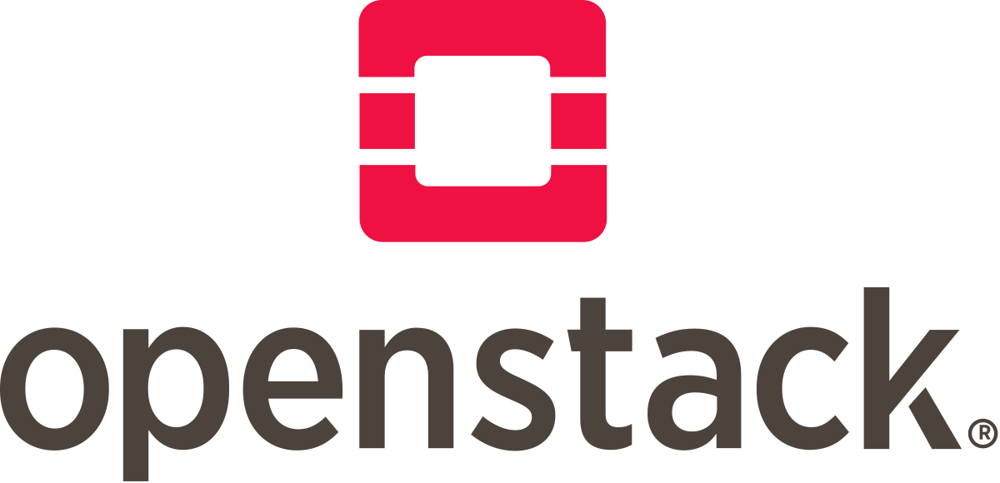

# General introduction

Back to main gallery:

  

    
  

  

    <strong>Openstack Gallery</strong> 
    
Back to main Openstack Gallery page.

    

    <a href="openstack.md" 
       style="text-decoration:none;color:#1d70b8;font-weight:bold;">View Notebook</a>
  

### Images
Images for your virtual machine are essentially the operating system. Currently, our available images are:
- Ubuntu
- Rocky
- Debian

If you would like to work with another image, please send a request to <a href="mailto:support@eodc.eu">support@eodc.eu</a>.

### Flavors
Flavors are the resources that you can allocate to your virtual machine.
Their naming convention consists of the number of CPUs and RAM.

### Volumes
Volumes are where and how you store your data.

We offer six different volume types in the EODC Cloud.  
This is divided between two options for replication and three different performance profiles.

The figures below are based on a 10GB volume size:

speed    |desired bw    | max bw    | desired iops    | max iops    | 
| --- | --- | --- | --- | --- | 
slow    |    2GBps    | 5GBps        |    5000        |    10k        |  
medium    |    5GBps    | 10GBps    |    15k            |    30k        |  
ultra    |    20GBps    | 50GBps    |    100k        |     1M        |  

Depending on your specific use case, there are different options to consider. Find some suggestions below:
- We recommend using the default volume size (15GB) for boot devices.  
- For additional storage needs, we recommend using additional volumes. This affords much greater flexibility, including allowing for later dynamic size changes.
- For critical data, a replication factor of 3 is recommended.

Our default volume type is "med-3repl".  
We feel this offers the best balance between cost and performance while ensuring the highest level of data integrity.  
We're happy to change the default volume type in your openstack project, just reach out to <a href="mailto:support@eodc.eu">support@eodc.eu</a>.
