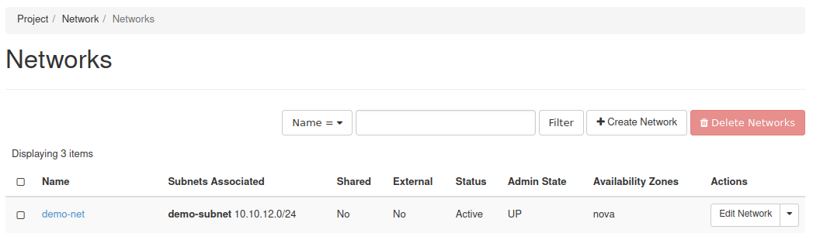
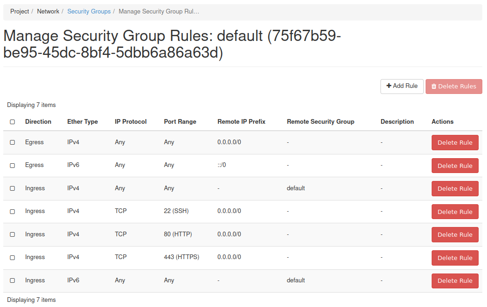
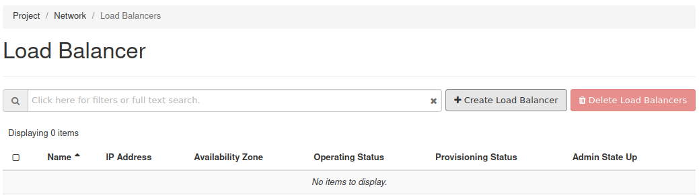
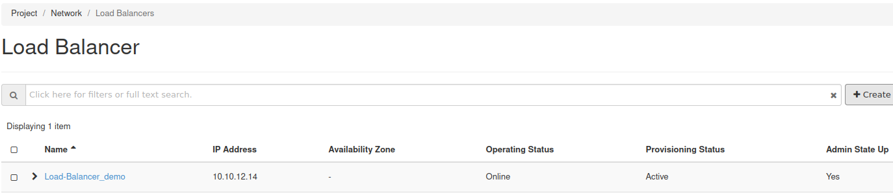
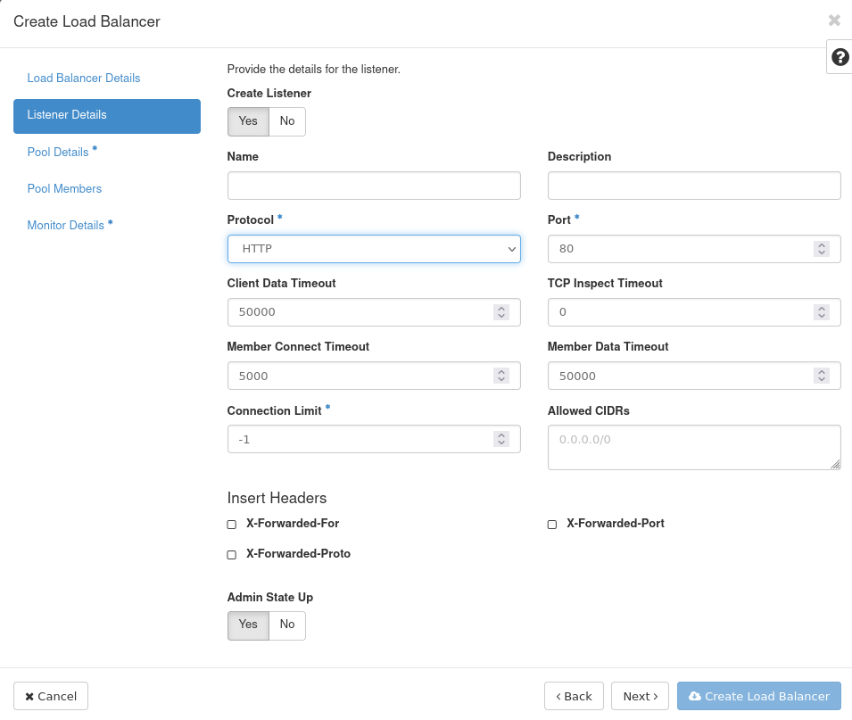
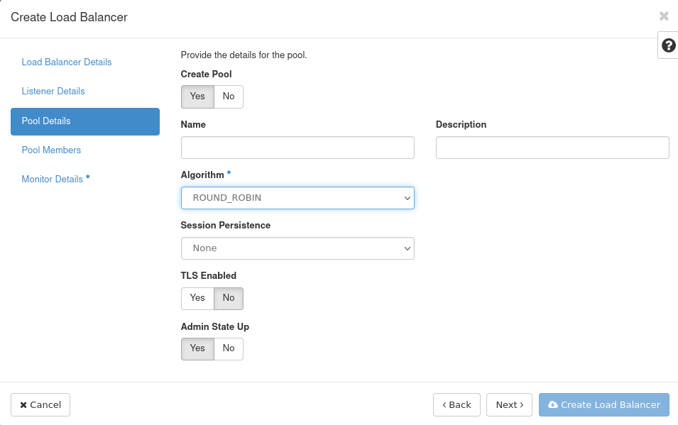
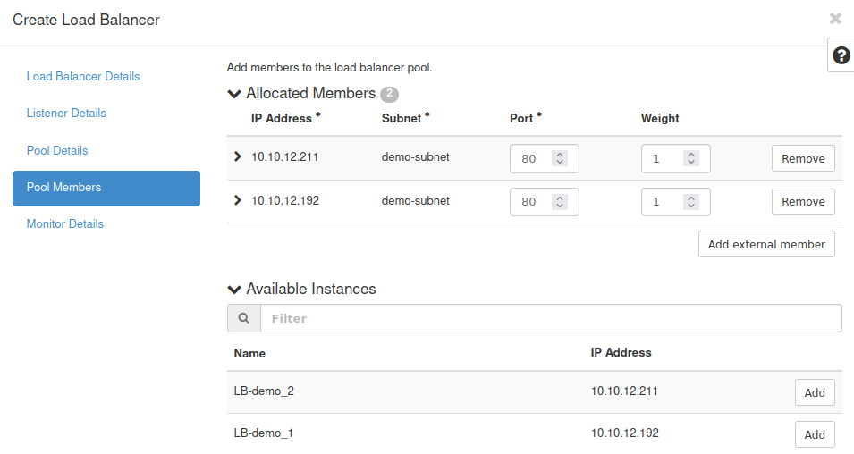
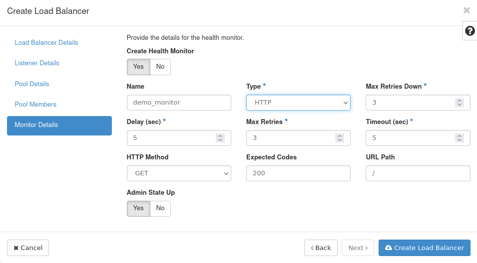
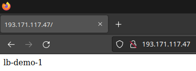

# Load Balancer

Back to main gallery:

<div class="notebook-card" data-tags="" 
     style="display:flex;align-items:flex-start;border:1px solid #cddff1;
            border-radius:6px;padding:14px 20px;background:#f9fbfe;
            box-shadow:1px 1px 4px #dfeaf5;margin-bottom:20px;">
  <div style="width:120px;height:90px;flex-shrink:0;display:flex;
              align-items:center;justify-content:center;background:#fff;
              border:1px solid #e0eaf5;border-radius:6px;overflow:hidden;
              margin-right:24px;">
    
  </div>
  <div style="flex:1;">
    <strong>Openstack Gallery</strong><br>
    <div style="margin:4px 0 8px 0;">Back to main Openstack Gallery page.</div>
    <div style="margin:6px 0 10px 0;"></div>
    <a href="openstack.md" 
       style="text-decoration:none;color:#1d70b8;font-weight:bold;">View Notebook</a>
  </div>
</div>

## How to Create a Load Balancer

Load Balancing in OpenStack is made possible by the [Octavia](https://docs.openstack.org/octavia/latest/) service.

In this guide, you will learn how to create a load balancer to distribute network traffic between two instances. The example load balancer created will listen on an external, publicly reachable IP address and route packets in a round-robin fashion across two instances on an internal private network.

## Prerequisites

Before getting started, the OpenStack project's quotas may need to be adjusted and you should have an SSH key added.

### Project Quota

Before creating a load balancer, ensure your project's quotas are set appropriately.
To see current project quotas, navigate on cloud.eodc.eu to `Compute > Overview`.
To adjust project quotas, simply write an email with the your required quota to support@eodc.eu.
This guide requires the following resources:

- 2 instances
- 2 VCPUs
- 2GB RAM
- 50GB Disk space
- At least one floating IP
- 1 network
- 1 router

### Project Roles

To create a load balancer, the project user must be the project owner or the user's role must be set to load-balancer_admin.

### SSH Key

You will need an SSH public key added to the project used to access the instances over SSH to install NGINX.

## Procedure

This section explains the steps needed to create a round robin load balancer. To create this load balancer, first a network and router are required. Next, security groups allowing specific network traffic need to be created. Finally, two instances will be spun up and NGINX installed to each. Once those steps are complete, the guide will walk through creating the load balancer.

This guide does not go into full detail on how to create the private network, router, security groups, and instances.
For assistance with creating these items see the other articles in the knowledgebase.

### Prepare Network, Router, and Security Groups 
#### Create Network

To get started, you need to create a private network.
To create this network, load Project -> Network -> Networks in Horizon and follow the Create Network link.
This example uses the private network called test-net with subnet 192.168.99.0/24:




Create Router

After creating the private network, a router needs to be made. The purpose of the router is to bridge the External network with the private one.

To make the router, navigate to Project -> Network -> Routers in Horizon and follow the Create Router link.

This example uses a router called router-1 which connects the External network and test-net networks together.
Create Security Groups

The instances will require inbound network traffic for HTTP, HTTPS, SSH, and ICMP.

You will need to create security groups allowing inbound traffic for each type.

For this example, a single security group has been created allowing inbound traffic for HTTP, HTTPS, SSH, and ICMP as can be seen in this screenshot:



### Create and Prepare Instances 

This load balancer will balance the load between two instances. Each will run Ubuntu with a basic NGINX installation.

#### Create Instances

Two instances need to be created for this demonstration.

Create them using these details:

- Operating System: Ubuntu 20.04 (focal-amd64)
- Flavor: **Insert flavor**
- Network: The private network previously created
- Security Group: Inbound HTTP, HTTPS, SSH, ICMP
- SSH key: A key you can use to access instances over SSH

Note that in the instance creation form you can specify multiple instances be created at once using the Count form option.

This example makes use of these two instances:

Once the instances are ready, assign a floating IP address to each one so you can access them with SSH.
Or to access instances without floating IPs you can use the floating IP of another instance as a jumphost.
`ssh -J user@floatingIP user@internalIP`

#### Install NGINX

Using each instance's floating IP, access each one and install NGINX.

Here is one way to accomplish this:

```bash
ssh eodc@<floating-ip>
sudo su -
apt-get update && \
    apt-get install -y nginx && \
    echo $(hostname) > /var/www/html/index.html
```

The above uses SSH to login to one of the servers, then logs in as root, installs NGINX using apt-get, and creates a basic, unique webpage with the server's hostname as output.

This needs to take place on both servers.

## Create Load Balancer

With the previous steps complete, everything is prepared to create the load balancer.

### Step 1 -- Navigate to Load Balancer Form

To create a load balancer navigate to `Project > Network > Load Balancers` and follow the Create Load Balancer link.




### Step 2 -- Load Balancer Details

On the first page you have to fill in at least:
- Name: Specify a name for the load balancer
- Subnet: Choose the External network

All other details are not required for this demonstration.



### Step 3 -- Listener Details

On this page, only the Protocol needs to be set:
- Protocol: HTTP



### Step 4 -- Pool Details

This page only needs the Algorithm option set.
- Algorithm: ROUND_ROBIN



### Step 5 -- Pool Members

This page is where you will specify the instances for which to perform load balancing.
Choose the two instances created for the load balancer.
Next, set each instance's Port to port 80.



### Step 6 -- Monitor Details

For the Monitor Details, choose a Name for the monitor and set the Type to HTTP.
- Name: Name of the monitor
- Type: HTTP



Click Create Load Balancer to spawn a new load balancer.

### Step 7 -- Verify Load Balancer Creation

The load balancer will appear in the list and its Provisioning Status will probably be, "Pending Create".


Now wait for the load balancer to be created. Once this is done, the Provisioning State will change to "Active".

### Step 8 -- Test Load Balancer

When the load balancer is up and ready look up the floating IP and put it in your browser to see the hostnames of one of your instances each time you refresh.




