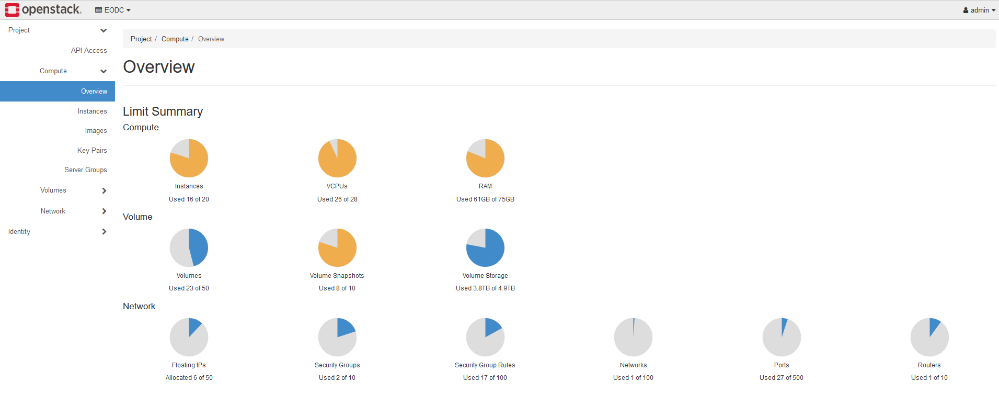

# Openstack

We are happy to announce that our new OpenStack environment [EODC Cloud](https://cloud.eodc.eu) has launched!

  

    
  

  

    <strong>Openstack General</strong> 
    
Short general introduction on Openstack, Images, flavors, ...

    

    <a href="general.md" style="text-decoration:none;color:#1d70b8;font-weight:bold;">View Notebook</a>
  

  

    
  

  

    <strong>Openstack Starting</strong> 
    
Description on how to start with the Openstack service.

    

    <a href="openstack_starting.md" style="text-decoration:none;color:#1d70b8;font-weight:bold;">View Notebook</a>
  

  

    
  

  

    <strong>Loadbalancers</strong> 
    
How to create a load balancer to distribute network traffic between two instances.

    

    <a href="loadbalancers.md" style="text-decoration:none;color:#1d70b8;font-weight:bold;">View Notebook</a>
  

  

    
  

  

    <strong>Distributions</strong> 
    
Learn about our distributions available in Openstack

    

    <a href="distributions.md" style="text-decoration:none;color:#1d70b8;font-weight:bold;">View Notebook</a>
  

There are certain things that need to be clarified and explained before you can go ahead and start using your resources on our new infrastructure. OpenStack is an open-source cloud operating system consisting of various components which handle virtualised compute resources. We use an OpenStack environment for the cloud infrastructure service to provide resources to our users.

In order to work with your cloud infrastructure, we will set up an OpenStack "tenant" with a unique identiifer for your company or your project.
In OpenStack, a tenant is a logical group of users and resources that are isolated from other tenants. Each tenant has its own set of users, who can launch virtual machines, manage networks and storage resources.
Please contact us first for an individual offer via office@eodc.eu. After finding a suitable package for you and once your tenant is setup, please create an EODC account following [this](eodc.eu/register) link. Upon confirmation the EODC OpenStack [launcher](https://launcher.eodc.eu/auth/login/?next=/) will give you full control over your resources.

Accessing your tenant is either possible via the [OpenStack Dashboard](https://docs.openstack.org/horizon/latest/user/index.html) or via the [OpenStack API](https://docs.openstack.org/api-quick-start/).  
As a preview, you can see how the Dashboard looks like below:

