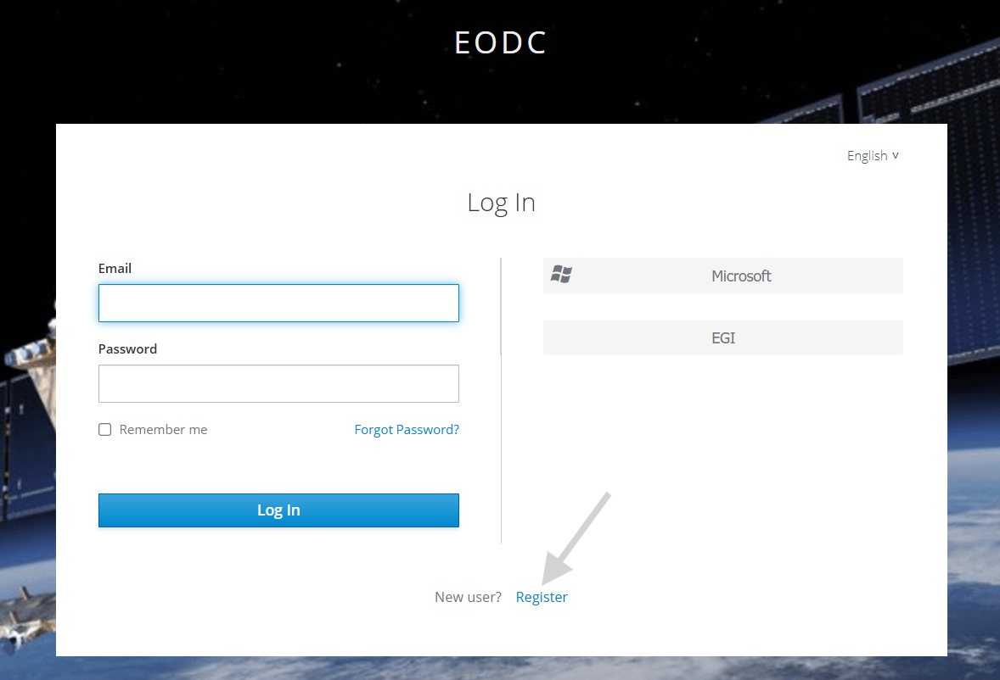
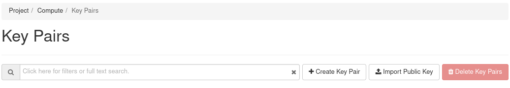
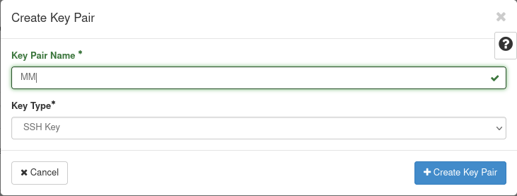
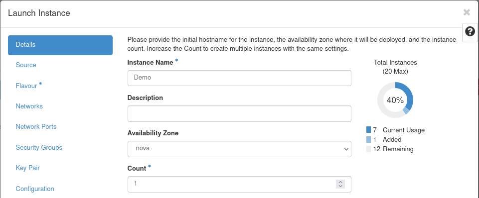
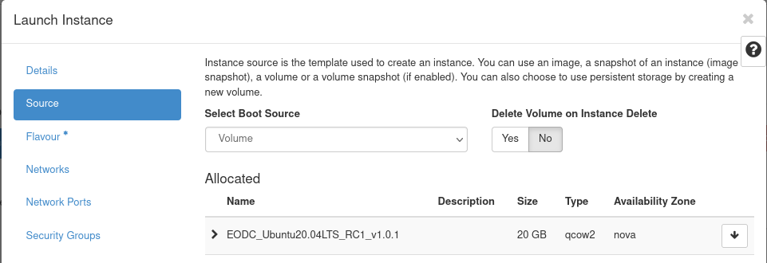
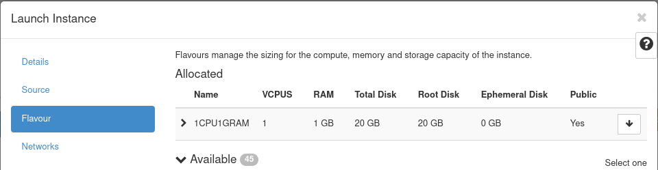
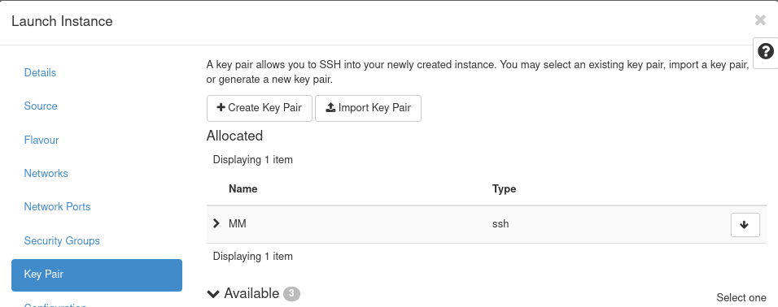
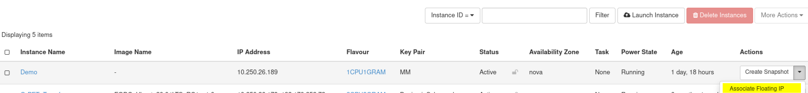

# Getting Started with OpenStack

Back to main gallery:

<div class="notebook-card" data-tags="" 
     style="display:flex;align-items:flex-start;border:1px solid #cddff1;
            border-radius:6px;padding:14px 20px;background:#f9fbfe;
            box-shadow:1px 1px 4px #dfeaf5;margin-bottom:20px;">
  <div style="width:120px;height:90px;flex-shrink:0;display:flex;
              align-items:center;justify-content:center;background:#fff;
              border:1px solid #e0eaf5;border-radius:6px;overflow:hidden;
              margin-right:24px;">
    
  </div>
  <div style="flex:1;">
    <strong>Openstack Gallery</strong><br>
    <div style="margin:4px 0 8px 0;">Back to main Openstack Gallery page.</div>
    <div style="margin:6px 0 10px 0;"></div>
    <a href="openstack.md" 
       style="text-decoration:none;color:#1d70b8;font-weight:bold;">View Notebook</a>
  </div>
</div>

## Table of Contents

- Signing In
- Generate keypair
- Create VM
- Associate floating IP
- Start and stop a VM
	- Suspend to stop
- Log into VM
- Upload/Share data
- Access /eodc
- Create group and add user


## Signing In
When you first reach [our Cloud](https://cloud.eodc.eu) you will see a few options to authenticate with:
- EODC Account (Default)
- Cloud Account
- EGI Check-in

#### EODC Account
To log in to the EODC cloud, each guest must create an EODC account. You can register at [eodc Cloud](https://cloud.eodc.eu) -> Authenticate using EODC Account -> New User? Register



These are per-user individual accounts, giving greater flexibility over permissions.

This identity may be federated with one of our supported providers, Microsoft and EGI.

Once your account is in-place and working, you can make use of these providers after selecting "EODC Account".

Your identity from these providers will be automatically federated with your EODC Account details.

If you would like to use the Openstack CLI with your EODC Account this is fully supported.

You can visit the [Application Credentials](https://cloud.eodc.eu/identity/application_credentials/) page to manage this.


#### Cloud Account
If you have requested and been granted a Cloud Account, you will be aware of it.

This is a more traditional username and password approach.


#### EGI Check-in
If you are using the EODC Cloud via an EOSC related project then EGI Check-in may be available to you.

This is can be used exclusively for these use cases.

If you have a typical project, instead select "EODC Account" and then follow through to EGI.


## Preparation
### For Windows Users
#### Install MobaXTerm
Go to [their homepage](https://mobaxterm.mobatek.net/) and download the .exe for the 'Home Edition' and install it.
This will be your terminal where you can 
- navagate the filesystem 
- copy data to and from your VM using a graphical file explorer
- access the shell using ssh

### For Linux and Mac Users
You can use your Terminal app to connect to your VM

## Generate keypair
When logged into Openstack navigate to Compute > Key Pairs in the sidebar.

- Click 'Create Key Pair'

- Type in a name for the keypair you will recognise later (e.g. your name or initials)
- For Key Type use 'SSH Key'

- Click 'Create Key Pair'

As soon as you create the keypair it will download your private key for you.
You need the private key to authenticate when connecting to the VM.

Linux and Mac users should put the downloaded private key into their `~/.ssh/` directory.
It should be called `id_rsa` without a file extension.
For Windows the name and location do not matter.
**The private key is only for you and should never be shared with anyone**
**If someone else needs access to the VM as well they need their own keypair**


## Create a VM
Navigate to Compute > Instances

- Click 'Launch Instance'
- Details
    - Fill out the name for the VM

- Source
    - Select the image you want to run as your VM
        - When in doubt just select Ubuntu 20.04 LTS

- Flavour
    - Select the resources for your VM (i.e. CPU and RAM)

- Key Pair
    - Select the keypair you created in the previous step

- Click 'Launch Instance'

After a short while the Status of the VM should change to 'Active'

## Associate floating IP
Navigate to Compute > Instances

There you choose the VM you want to have the floating IP
- Click the arrow on the right-hand side to open the dropdown menu
- Click 'Associate Floating IP'

- Under IP Address select the floating IP
- Click 'Associate'

## Log into a VM
Connecting to your VM will be done using SSH

### For Windows Users
**Insert MobaXterm instructions**

### For Linux and Mac Users
Open you Terminal App and type:
```bash
ssh <username>@<ip-address>

# In case your key is not in ~/.ssh/ or is called differently add -i
ssh -i path/to/the/key <username>@<ip-address>
```

## Creating groups and users
To access your private storage you need the group ID (gid) we provided you with in the welcome e-mail

In this example we will use 5000 as the group ID
The group name can be whatever, like the name of your project.

### Creating the group
First you need to create the group with the gid
```bash
sudo groupadd -g 5000 group_name
```

### Adding a user to the group
Next you have to add your user to the group
```bash
sudo usermod -aG group_name username
```
You can check which groups your user is part of use the `id` command: `id username`

Now you have to log out and back in again, and you should have access to your private storage.

## Adding users after VM creation
For other users to have access to the VM you can create additional users.

### Creating a new user
There are some things you can specify in this command
The most important flags are:
- `-G` to add the user to groups e.g. the one you created in the last step to access your storage
- `-m` to create a home directory for the user under `/home/username/`

The command for a basic user looks like that:
```bash
sudo useradd -m -G group_name username
```
