# STAC

  

    
  

  

    <strong>Data Discovery with STAC</strong> 
    
This notbook demonstrates how to access data from the EODC STAC catalogue

    

    <a href="python-stac_DataDiscovery.ipynb" style="text-decoration:none;color:#1d70b8;font-weight:bold;">View Notebook</a>
  

  

    
  

  

    <strong>Load Data from STAC</strong> 
    

This notbook demonstrates how to Load Data from the EODC STAC catalogue into Xarray
    

    <a href="python-stac_LoadDataXarray.ipynb" style="text-decoration:none;color:#1d70b8;font-weight:bold;">View Notebook</a>
  

  

    
  

  

    <strong>STAC and Jupyter</strong> 
    
This notebook demonstrates how STAC can be used in Jupyter.

    

    <a href="stac_jupyter" style="text-decoration:none;color:#1d70b8;font-weight:bold;">View Notebook</a>
  

  

    
  

  

    <strong>Example with Sentinel 2</strong> 
    
Here you find an example of the usage of STAC with Sentinel 2 data.

    

    <a href="Sentinel-2.md" style="text-decoration:none;color:#1d70b8;font-weight:bold;">View Notebook</a>
  

This is an introdcution on how to use the STAC Data Catalogue.

## Preconditions

### General
To access the desired data, there are three options: 

1. EODC Catalog in the Browser: This can primarily be used to check if the desired data is available. 
2. QGIS: Here, data with small spatial extents or from short time periods can be displayed. 
3. JupyterLab: JupyterLab: To visualize large amounts of data, JupyterLab can be used in combination with QGIS.

### EODC Catalogue in the Browser
Link: <https://services.eodc.eu/browser/#/?.language=en>

All required data is stored in the EODC Catalogue. Here, the desired catalog with the requested data can be opened.

### Filtering Data in the Browser
If only specific data from a catalog is needed, it can be searched using a filter. To do this, the desired catalog must be opened. On the right side, all layers are listed. By using the ‘Show Filters’ button, data can be filtered temporally or spatially. Under ‘Temporal Extent’ you can select the desired time period, and under ‘Spatial Extent’ you can choose the desired area. 

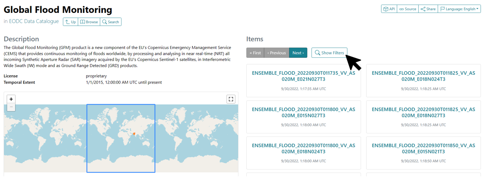

### QGIS
To open and display the data, QGIS is used. QGIS is an open-source geographic information system and can be downloaded from the following link: 
<https://www.qgis.org/en/site/forusers/download.html> 

After successfully installing and opening QGIS, you have to create a new project. On the left side, you’ll find the QGIS Browser. Under 'XYZ Tiles' you can right-click to select OpenStreetMap and add it to your map using the 'Add Layer to Project' option. You can zoom in and out of the map by rotating the mouse wheel and dragging the map is possible with the left mouse button. Alternatively, you can use the magnifying glasses in the toolbar at the top of the window for zooming.  

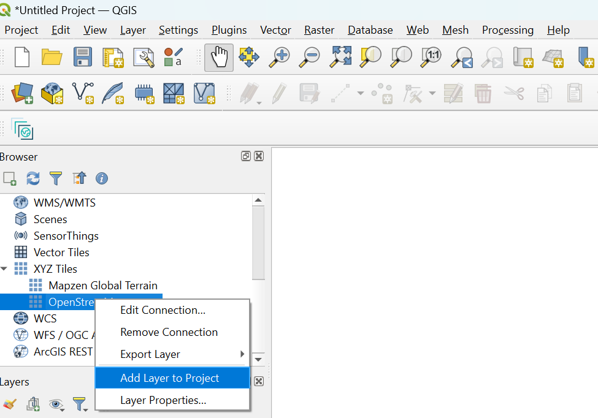 

A plugin still needs to be installed. To do this, open the overview of all plugins via the tab `Plugins > Manage and Install Plugins`. A new window opens and the STAC API Browser plugin is searched for via the search line and then 'Install' Plugin is pressed. Once the plugin has been installed, the window can be closed again.

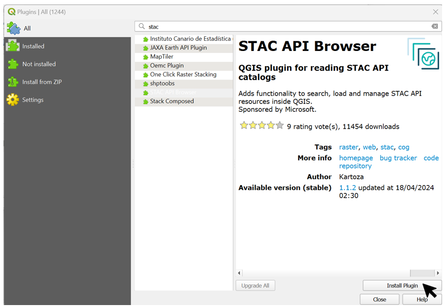

In order to access the EODC stack, it still needs to be connected. To do this, open the STAC API Browser under `Plugins > STAC API Browser Plugin > Open STAC API Browser` . A new connection is created (Connections -> New). The name can be chosen as desired and the URL is: https://stac.eodc.eu/api/v1. Use 'Test Connection' to ensure that the connection works and click on 'OK' to create the connection. To display the catalogs, click on the 'Fetch collections' button. 

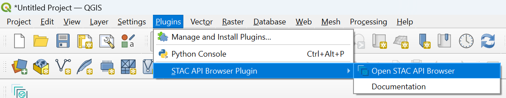
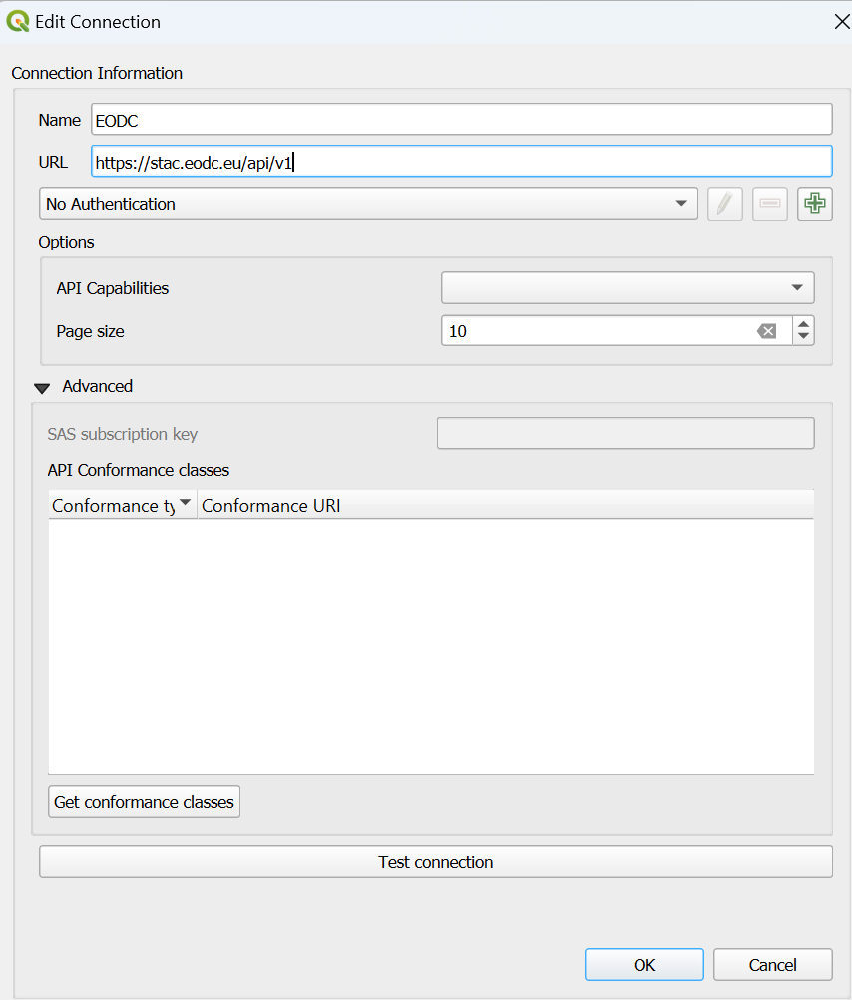

### Filtering the data in QGIS
In order to obtain only the desired data in QGIS, it is also possible to filter the data. The plugin described above is required for this.
To display all data, the Open STAC API Browser must be opened (Plugins -> STAC API Browser Plugin -> Open STAC API Browser). The connection to the EODC stack is selected as the connection. The desired data set can be selected under Collections. Further down there is the option to filter by date and by extent.
To search for a desired time period, check the 'Filter by date' box and select the desired time. To filter by extent, the OpenStreetMap must be open in QGIS as described above. Under 'Filter by date' there is the checkbox 'Extent'. This must be activated. The desired extent can either be specified using coordinates or selected on the map using 'Draw on canvas'. 
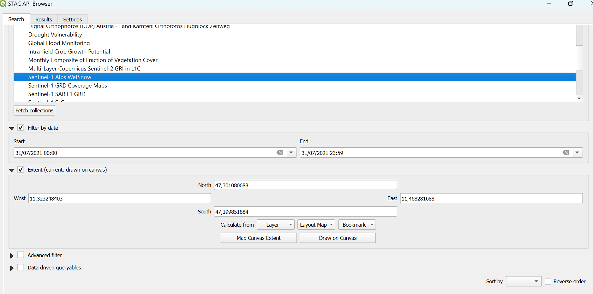 

After the desired filters have been set, press 'Search'. A window with all available layers will now open. To load these into the map, open 'View assets' and activate the checkbox 'Select to add as a layer' for 'image/tiff; application=geotiff'. The layer is then added to the map with 'Add selected assets as layers'. This step must be repeated for all search results, then the Open STAC API Browser can be closed again.  

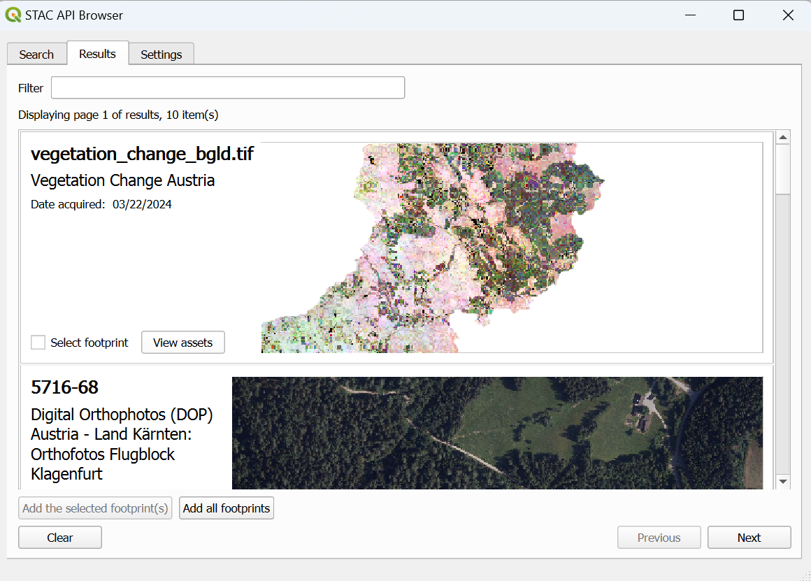
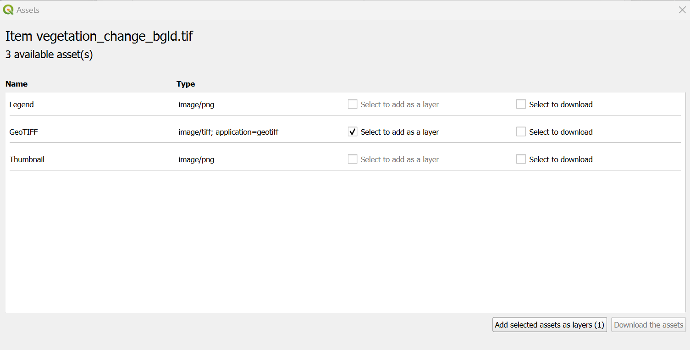   

To see the layer in the map field, right-click on the layer and select 'Zoom to Layer'. 
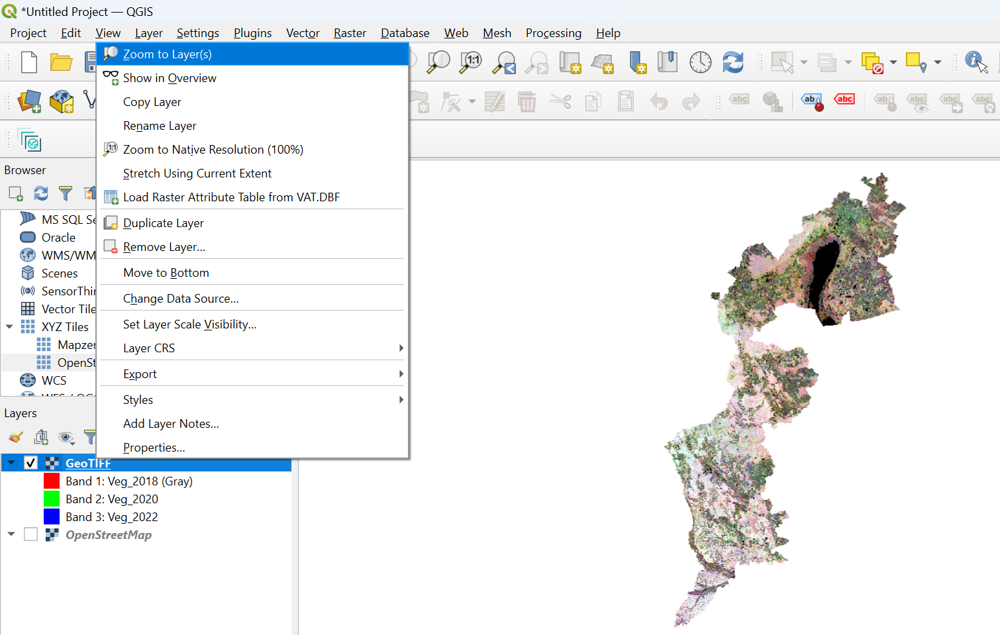

### Ortophoto

With the help of a so-called Web Map (Tile) Service (WMS/WMTS), an orthophoto of Austria can be loaded into QGIS. The browser is located on the left-hand side of QGIS. Here you have to search for WMS/WMTS and establish a new connection by right-clicking -> new Connection. A new window opens. Any name can be entered here, e.g. Ortophoto Austria. Under URL, <https://mapsneu.wien.gv.at/basemapneu/1.0.0/WMTSCapabilities.xml> must be entered. The new connection is established with 'OK' and the Ortophoto becomes visible.

## Soil Sealing Identification

To access the data and the legend for Soil Sealing Identification, the EODC Data Catalogue must be opened. Then search for the Vegetation Change Austria catalog and open it. A preview of the vegetation_change_bgld.tif layer is displayed on the right-hand side. Below the preview, click on the .tif name of the layer to open a new page with the information and download options for the layer. On this page, the legend can be downloaded and opened under `Assets > Legend > Open`. 

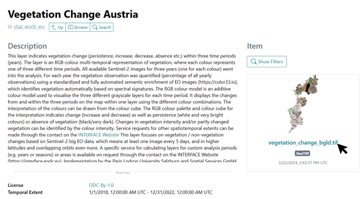
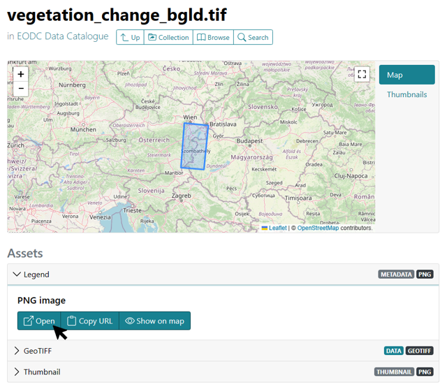

The vegetation_change_bgld layer is now loaded into QGIS as described above. To be able to interpret the map, the legend must also be opened. The colors indicate whether and in which years vegetation was detected. For example, all light areas mean that vegetation was always detected in 2018, 2020 and 2022. Red areas, such as west of the lake, mean that vegetation was only detected in 2018 and not in the following years.

If no Ortophoto has been loaded yet, one can be used as a basis here. On the left-hand side under Layers, the individual layers can be moved. The layer that is displayed at the top here is also at the top of the map. The order can be changed using drag and drop. The checkbox in front of each layer name can be used to make the layers visible or invisible.

## Wet Snow

The data for the wet snow characterization are the Sentinel-1 Alps WetSnow layers. These can be loaded into QGIS using the Open STAC API browser as described above. Pink areas represent wet (melting) snow, for example.

