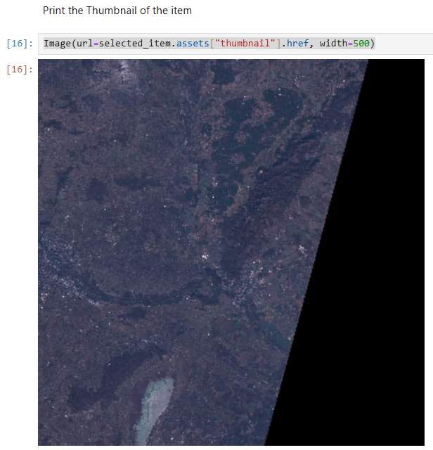
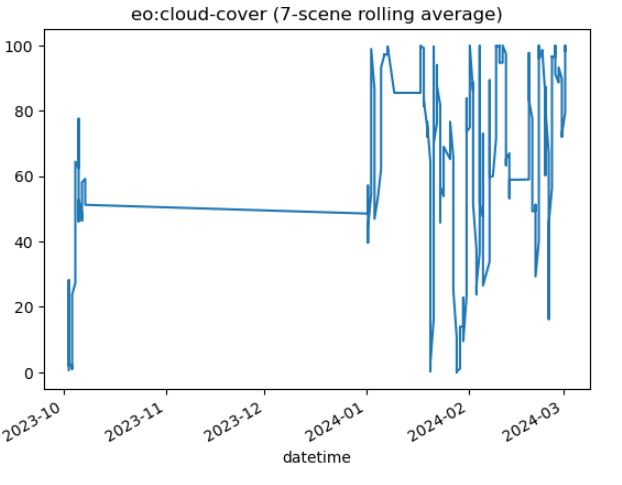
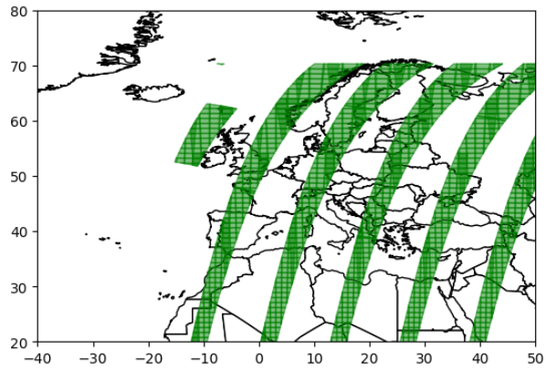
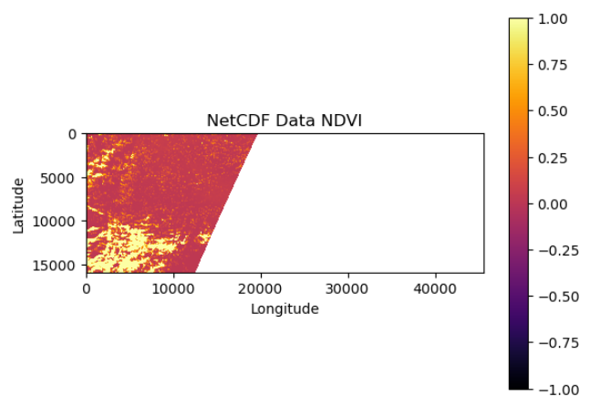

# Using STAC in a Jupyter Notebook

Back to main gallery:

<div class="notebook-card" data-tags="" style="display:flex;align-items:flex-start;border:1px solid #cddff1;border-radius:6px;padding:14px 20px;background:#f9fbfe;box-shadow:1px 1px 4px #dfeaf5;margin-bottom:20px">
  <div style="width:120px;height:90px;flex-shrink:0;display:flex;align-items:center;justify-content:center;background:#fff;border:1px solid #e0eaf5;border-radius:6px;overflow:hidden;margin-right:24px;">
    
  </div>
  <div style="flex:1;">
    <strong>STAC</strong><br>
    <div style="margin:4px 0 8px 0;">Back to main gallery.</div>
    <div style="margin:6px 0 10px 0;"></div>
    <a href="stac.md" style="text-decoration:none;color:#1d70b8;font-weight:bold;">View Notebook</a>
  </div>
</div>

## Overview 
Datasets hosted at EODC are cataloged by making use of the STAC (SpatioTemporal Asset Catalog) specifications. The catalog service is available as STAC API via https://stac.eodc.eu/api/v1 to enable users to discover and search for datasets filtering by space, time and other attributes. In addition to QGIS, the STAC catalog can also be accessed in a Jupyter notebook. This is particularly useful for larger data, as QGIS cannot handle those.

In the following, three Jupyter notebooks are used to explain how STAC can be used in Jupyter.

## 1. Discover Data via the STAC API

The [first notebook](https://github.com/eodcgmbh/eodc-examples/blob/main/demos/python-stac_DataDiscovery.ipynb) explains how to connect to the STAC catalog and how to load and discover data.

### Searching for STAC collections and items
The pystac_client can be used to access the STAC catalog of the EODC directly. This has the great advantage that the data does not have to be downloaded locally and then loaded into the notebook, but can be processed immediately.

```
eodc_catalog = Client.open(
    "https://stac.eodc.eu/api/v1",
)
```

You can search for single, multiple or all collections with .get_collection()

```
collection = eodc_catalog.get_collection("SENTINEL2_L1C")
```

With the .get_all_items() function you get all items of the selected collection. You can then search the items for properties such as cloud coverage.

```
items = collection.get_all_items()
```

### Searching for items in a collection with filter criterias

As in the web STAC catalog, the data can be filtered according to temporal and spatial extent. We define the spatial extent with the help of GeoJSON (or a bounding box) and the temporal extent with a time range.

```
time_range = "2023-05-01/2024-05-01"

# Area around the Neusiedler See
area_of_interest = {
"coordinates": [
          [
            [
              16.685331259653253,
              48.001346032803355
            ],
            [
              16.621884871275512,
              47.902601630022275
            ],
            [
              16.62588718725482,
              47.81041047247777
            ],
            [
              16.664809254423375,
              47.774602171781936
            ],
            [
              16.96808652311867,
              47.76771348708101
            ],
            [
              16.963971948548988,
              48.00956486424042
            ],
            [
              16.685331259653253,
              48.001346032803355
            ]
          ]
        ],
        "type": "Polygon"
      }

```

Then we can search for Sentinel-2 data (from our collection above), that matches our filter criteria and save them in a item collection. The notebook also describes how to display the assets of an item in a table.

```
search = eodc_catalog.search(
    collections=["SENTINEL2_L1C"],
    intersects=area_of_interest,
    #bbox = bbox_aut,
    datetime=time_range
)

items_eodc = search.item_collection()
```

Here, too, we can search for the item with the lowest cloud cover, for example, and then plot it.

```
selected_item = min(items_eodc, key=lambda item: item.properties["eo:cloud_cover"])

Image(url=selected_item.assets["thumbnail"].href, width=500)
```




## 2. Analyzing STAC Metadata

The [second notebook](https://github.com/eodcgmbh/eodc-examples/blob/main/demos/python-stac_AnalyzingMetadata.ipynb) is about analysing the metadata.

### Rolling average of the cloud-cover

First, you can create a rolling average of the cloud cover over Austria of Sentinel-2 in a specific time range. For this, we use a geodataframe.

```
df = geopandas.GeoDataFrame.from_features(items.to_dict())
df["datetime"] = pd.to_datetime(df["datetime"])

ts = df.set_index("datetime").sort_index()["eo:cloud_cover"].rolling(7).mean()
ts.plot(title="eo:cloud-cover (7-scene rolling average)");
```



We can see, that in this example there is no data from November and December.


### Visualize the data coverage

Another way to analyse our data is to visualize, for example, the Sentinel-2 L1C data over Europe. So we need to search for the Sentinel-2 items within the spatial extent of europe.

```
bbox_eu = [-63.151187329826996,
 -21.349632697207902,
 55.834818182891276,
 70.09213659004354]

time_range_eu = "2024-03-01/2024-04-01"

search_eu = eodc_catalog.search(
    collections=["SENTINEL2_L1C"],
    bbox = bbox_eu,
    datetime=time_range_eu
)
items_eu = search_eu.item_collection()
```

Then, we can create a map with all found items over Europe.

```
df = geopandas.GeoDataFrame.from_features(items_eu.to_dict())

world = geopandas.read_file("./data/world-administrative-boundaries/world-administrative-boundaries.shp")
ax = world.plot(color='white', edgecolor='black')
df.plot(ax=ax, edgecolor='green', facecolor="green", alpha=0.5, linewidth=1)
ax.set_xlim([-40,50])
ax.set_ylim([20,80])
plt.show()
```




## 3. Load Data from the EODC STAC catalogue into Xarray

In the [third notebook](https://github.com/eodcgmbh/eodc-examples/blob/main/demos/python-stac_LoadDataXarray.ipynb) is described how to load data into a Xarray.

First we need to set some parameters. 

```
crs = "EPSG:4312"
res = 0.00018 # 20 meters in degree 
bands = ["red", "nir"]
```

Then we can load our items into a Xarray, an array that sets labels in the form of dimensions, coordinates and attributes on top of raw NumPy-like multidimensional arrays.
You can get more information about Xarray in the [Xarray documentation](https://docs.xarray.dev/en/stable/index.html).

```
ds = odc_stac.load(items,
                    crs=crs,
                    resolution=res,
                    bbox=bbox_aut,
                    bands = bands,
                    )
```

You can save the Xarray as a netCDF (and also load the netCDF into the notebook again).

```
ds.to_netcdf("./data/stac_xarray.nc")
```

```
nc_file = xr.open_dataset("./data/stac_xarray.nc")
```

Here we want to calculate the NDVI and plot the results. You can also plot e.g. single Bands or a true colour image.

```
red = nc_file['red']
nir = nc_file['nir']

def normalized_difference(x, y):
    nd = (x - y) / (x + y)
    return nd

ndvi = normalized_difference(nir, red)
```

Then you can plot your NDVI Xarray.
```
p = plt.imshow(time_data, vmin = -1,  vmax = 1, cmap = "inferno")
plt.colorbar(p)
plt.xlabel("Longitude")
plt.ylabel("Latitude")
plt.title("NetCDF Data NDVI")
plt.show()
```


